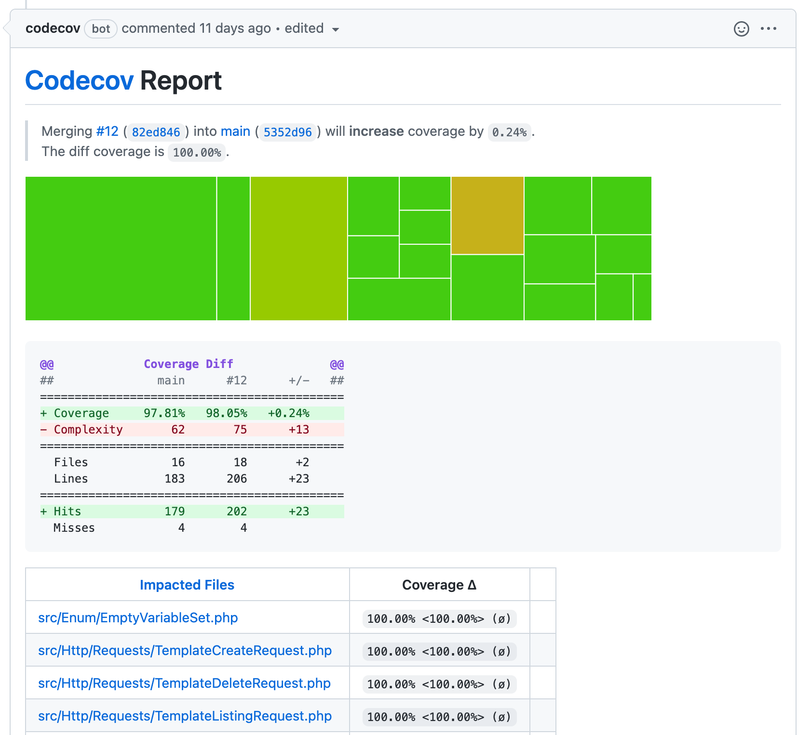

# Testowanie.

## Teoria i przykłady w JavaScript

> Pisanie testów to wykrywanie błędów przez programistów w trakcie pisania kodu źródłowego zamiast w najgorszym możliwym momencie - na produkcji przez klienta.

Mateusz Wojczal 2020


---

# Typy testów

Nie ma jasnego podziału typów testów. Często są mylone grupy i typy. Oprócz podziału na uruchamiane `ręczne` lub `automatyczne` sąjeszcze:

- `Strukturalne` - testy białej skrzynki, skupiają się tylko i wyłącznie na testowaniu kodu bądź systemu. Są one przeciwieństwem testów czarnej skrzynki.
- `Niefunkcjonalne` — testowanie atrybutów modułu lub systemu, które nie odnoszą się do jego funkcjonalności, np. niezawodności, efektywności, pielęgnowalności i przenaszalności.
- `Funkcjonalne` – testy czarnej skrzynki, oparte na analizie specyfikacji funkcjonalnej modułu lub systemu.

---

# Typy testów. cd

| **Strukturalne**    | **Niefunkcjonalne** | **Funkcjonalne** |
| ------------------- | ------------------- | ---------------- |
| wewn. struktur      | wydajnościowe       | integracyjne     |
| jednostkowe         | obciążeniowe        | end-to-end       |
| standardu kodowania | przeciążeniowe      | \* akceptacyjne  |
| instalacji          | użyteczności        | \* mutacyjne     |
| kompilacji          | pielęgnowalności    | \* behawioralne  |
|                     | niezawodności       |                  |
|                     | przenaszalności     |                  |

plus Testy **Regresji, Wizualne (snapshots)** i inne (np. **Chaos monkey**).

---

| **Testy niefunkcjonalne**                   |                                                                      |
| ------------------------------------------- | -------------------------------------------------------------------- |
| Wydajnościowe                               | sprawdzimy obciążenie systemu. Jak długo trwa odpowiedź serwera itp. |
| Przeciążeniowe (częśćwydajnościowych) | przy ograniczeniu bądź braku zasób tj: procesor, pamięć, dysk, itp.  |
| Obciążeniowe                                | przy zwiększonej ilości użytkowników, rekordów, itp.                 |
| Użyteczności (ux)                           | łatwość korzystania z oprogramowania.                                |
| Pielęgnowalności                            | łatwość modyfikacji i dostosowań do nowych wymagań.                  |
| Niezawodności                               | wykonanie wymaganych funkcji w określonych warunkach.                |
| Przenaszalności                             | łatwość przeniesienia z jednego środowiska na drugie.                |

---

# Typy testów. Skrzynki

Powszechnie stosowanymi podziałami testów są techniki:

- **Białej skrzynki** - tester zna budowę systemu i wie, jak odbywają się poszczególne procesy. Program napisany w JS będzie miał testy napisane w JS
- **Czarnej Skrzynki** — tester nie ma pojęcia, jak skonstruowany został testowany system. Poprzez dostępny interface (Przeglądarka, Rest API, CLI) framework testuje dostępne na zewnątrz funkcjonalności.

---

# Typy testów. cd

| **Białej skrzynki** | **Czarnej Skrzynki**                                      |
| ------------------- | --------------------------------------------------------- |
| wewn. struktur      | end-to-end                                                |
| jednostkowe         | akceptacyjne                                              |
| standardu kodowania | behawioralne                                              |
| instalacji          | \* jednostkowe                                            |
| kompilacji          | wydajnościowe, obciążeniowe, przeciążeniowe, użyteczności |
| integracyjne        | pielęgnowalności, niezawodności, przenaszalności          |
| mutacyjne           |                                                           |

---

# Testy białej skrzynki

---

## Testy jednostkowe

Testy jednostkowe są przeprowadzane na bardzo niskim poziomie aplikacji, bardzo zbliżonym do kodu źródłowego oprogramowania i polegają na testowaniu poszczególnych metod i funkcji klas, komponentów lub modułów wykorzystywanych w programie.
Automatyzacja jest prosta i mogą one być bardzo szybko przeprowadzane przez serwer ciągłej integracji (jednocześnie).

```js
// app
const add = (a, b) => a + b;

// TEST. framework jest
expect(add(2, 2)).toBe(4);
```

---

## Testy jednostkowe (blackbox)

Testy jednostkowe mogą być użyte jako testy czarnej skrzynki. Np testowanie implementacji kontraktu, lub w pierwszych etapach TDD (o którym będzie za chwilę więcej).

```ts
// app
type AddFn = (a: number, b: number) => number;

const add: AddFn = (a, b) => {
  /* blackbox */
};

// TEST. framework jest
expect(typeof add(2, 2) === "number").toBe(true);
expect(add(2, 4) === add(4, 2)).toBe(true);
```

Jednak powszechnie są traktowane jako testy białej skrzynki.

---

## Testy integracyjne

Testy integracyjne sprawdzają, czy różne moduły lub usługi wykorzystywane przez oprogramowanie dobrze ze sobą współpracują. Tego poziomu testy mogą być stosowane na przykład w celu sprawdzania interakcji aplikacji z bazą danych lub upewnienia się, że mikro-usługi działają zgodnie z postawionymi wymaganiami i oczekiwaniami, wymagają one uruchomienia wielu elementów aplikacji.

```js
// app
const request = require("supertest");
const app = require("express")();

app.get("/user", (req, res) => res.status(200).json({ name: "john" }));

// TEST. framework jest
request(app)
  .get("/user")
  .expect("Content-Type", /json/)
  .expect(200) // http code
  .then((response) => assert(response.body.name, "john"));
```

---

## Testy jednostkowe a integracyjne

Przykład. Testowanie funkcji i implementacji losowej liczby z funkcji `getRandom(min:number, max:number)`

```js
describe("This is Unit Test", () => {
  it("Should generate a random whole number between 0 and 100", () => {
    const random = getRandom(0, 100);
    assert.isNumber(random);
    assert.isAtLeast(random, 0);
    assert.isAtMost(random, 100);
  });
});
```

```js
describe("This is Integration Test", () => {
  it("Gets random number from endpoint", (done) => {
    chai
      .request(app)
      .get("/random?min=0&max=100")
      .end((err, res) => {
        assert.isNumber(res.body.number);
        assert.isAtLeast(res.body.number, 0);
        assert.isAtMost(res.body.number, 100);
      });
  });
});
```

---

# Code Coverage.

Pokrycie liniej kodu testami

---

## Pokrycie Kodu (code coverage)

Pokrycie kodu określa które części (linie kodu) programu zostały przetestowane przez testy jednostkowe i integracyjne.


---

## Pokrycie Kodu. Przykład Gitlab.

Pokrycie kodu bardzo dobrze współpracuje z Continuous Integration


---

## Pokrycie Kodu. Standard junit.

Pokrycie kodu bardzo dobrze współpracuje z Continuous Integration. Raport HTML `jUnit`


---

## Testy jednostkowe. Regresja. Core Review.

Pokrycie kodu bardzo dobrze współpracuje z Continuous Integration. Zmiana w Merge Request


---

## Testy jednostkowe. Github i Codecov.

Pokrycie kodu bardzo dobrze współpracuje z Continuous Integration. Zmiana w Pull Request



---

## Testy statyczne (standard kod.)

Test polega na automatycznym sprawdzaniu kodu w celu znalezienia bÅ‚Ä™dów. Przykładowe narzędzia tj. `sonarqube`, `codeclimate`, `eslint` itp.

```bash
~ codeclimate analyze
Starting analysis
Running structure: Done!
Running duplication: Done!
Running eslint: Done!

== coverage/lcov-report/block-navigation.js (2 issues) ==
2-78: Function `init` has a Cognitive Complexity of 9 (exceeds 5 allowed). Consider refactoring. [structure]
2-78: Function `init` has 57 lines of code (exceeds 25 allowed). Consider refactoring. [structure]

== coverage/lcov-report/sorter.js (3 issues) ==
2-168: Function `addSorting` has a Cognitive Complexity of 38 (exceeds 5 allowed). Consider refactoring. [structure]
2-168: Function `addSorting` has 138 lines of code (exceeds 25 allowed). Consider refactoring. [structure]
126-157: Function `enableUI` has 26 lines of code (exceeds 25 allowed). Consider refactoring. [structure]

== src/actions/ArticleActions.js (1 issue) ==
19-29: Similar blocks of code found in 3 locations. Consider refactoring. [duplication]
...
```

---

## Testy statyczne (standard kod.)

Ciąg dalszy.

```bash
$ eslint . --fix
/Users/qunabu/Desktop/localhost/pupile-web/src/actions/UserActions.js
   33:26  error  'res' is defined but never used  no-unused-vars
  123:12  error  'res' is defined but never used  no-unused-vars
  139:12  error  'res' is defined but never used  no-unused-vars

/Users/qunabu/Desktop/localhost/pupile-web/src/components/ArticlesPage/ArticlesPage.js
  31:11  error  Missing "key" prop for element in iterator  react/jsx-key

/Users/qunabu/Desktop/localhost/pupile-web/src/reducers/Visits.js
  100:7  error  Unexpected lexical declaration in case block  no-case-declarations

/Users/qunabu/Desktop/localhost/pupile-web/src/utils/utils.js
  17:13  error  Do not access Object.prototype method 'hasOwnProperty' from target object  no-prototype-builtins

✖ 92 problems (92 errors, 0 warnings)
...
```

---

# Testy czarnej skrzynki

---

## Testy end-to-end (e2e)

Symulują zachowanie użytkownika korzystającego z oprogramowania w pełnym środowisku aplikacji, sprawdzają czy wszystkie elementy aplikacji działają zgodnie z założeniami.

```js
// TEST. framework cypress
describe("My First Test", () => {
  it("Gets, types and asserts", () => {
    cy.visit("https://example.cypress.io");
    cy.contains("type").click();
    // Should be on a new URL which includes '/commands/actions'
    cy.url().should("include", "/commands/actions");
    // Get an input, type into it and verify that the value has been updated
    cy.get(".action-email")
      .type("fake@email.com")
      .should("have.value", "fake@email.com");
  });
});
```

---

# Behavior-Driven Development (BDD)

Tworzenie oprogramowania przez opisywanie jego zachowania z perspektywy jego użytkowników.

Różnica między BDD a TDD (Test Driven Development) to wykorzystanie zrozumiałego dla wszystkich języka, nawet osób bez wiedzy technicznej.

---

## Testy akceptacyjne (BDD)

Testy akceptacyjne są formalnymi testami oprogramowania przeprowadzanymi w celu sprawdzenia, czy dany system spełnia stawiane przed nim wymagania biznesowe. Wymagają one uruchomienia i poprawnego działania całości aplikacji i polegają na replikowaniu zachowań użytkowników. Tego poziomu testy mogą także obejmować nieco szerszy zakres, w który może wejść między innymi pomiar wydajności systemu oraz odrzucenie zmian w przypadku, gdy nie pozwalają one na osiągnięcie postawionych celów i wymagań.

```js
// TEST. framework codeceptjs
Feature("My First Test");

Scenario("test something", ({ I }) => {
  I.amOnPage("https://github.com");
  I.see("GitHub");
});
```

---

## Testy behawioralne. Gherkin

Gherkin to język służący do tworzenia przypadków testowych - definicja scenariusza jest zapisana za pomocą języka naturalnego.

```yaml
Feature: checkout
  In order to buy product
  As a customer
  I need to be able to checkout the selected products

Scenario: order several products
  Given I have product with $600 price in my cart
  And I have product with $1000 price in my cart
  When I go to checkout process
  Then I should see that total number of products is 2
  And my order amount is $1600
```

```js
Given(/I have product with \$(\d+) price/, (price) => {
  // Write code here that turns the phrase above into concrete actions
});
```

---

## Testy behawioralne. Gherkin cd.

Wdrozenie języka Gherkin. Przykład `codecept` i `Cucumber`. Wpierw Tester pisze scenariusze w języku naturalnym, następnie Framework przekształca je w testy JS które nie przechodzą i na końcu programista implementuje ich logikę.

```js
const { I, productPage } = inject();

Given(/I have product with \$(\d+) price/, (price) => {
  I.amOnPage("/products");
  productPage.create({ price });
  I.click("Add to cart");
});

When("I go to checkout process", () => {
  I.click("Checkout");
});

Then("I should see that total number of products is {int}", (num) => {
  I.see(num, ".cart");
});
Then("my order amount is ${int}", (sum) => {
  // eslint-disable-line
  I.see("Total: " + sum);
});
```

---

# Przykłady innych testów

---

## Testy mutacyjne.

Technika polegająca na generowaniu małych i losowych zmian w kodzie naszej aplikacji. Jeżeli wstrzyknięte zmiany te nie zostaną wykryte przez nasze testy, są one niewystarczające. Przykład `stryker-mutator`

```js
// Given this code:
function max(a, b) {
  return a < b ? b : a;
}

// And these tests:
describe('math', () => {
  it('should return 4 for max(4, 3)', () => expect(max(4, 3)).eq(4))
  it('should return 4 for max(3, 4)', () => expect(max(3, 4)).eq(4))
});

// Stryker will generate (amongst others) these mutants:
function max(a, b) {
-  return a < b ? b : a;
+  return true ? b : a; // 👽 1
+  return false ? b : a; // 👽 2
+  return a <= b ? b : a; // 👽 3
}
```

---

## Testy mutacyjne. CD


Każda wstrzyknięta zmiana nazywa się `mutantem`. Jeśli żaden z testów się nie wysypie - mutant przeżył (survived). Jeśli co najmniej jeden test się wywali, mutant został zabity (killed). Należy zabić wszystkie mutanty.

---

## Testy wizualne (snapshot)


---

## Testy snapshot kodu

Porównywanie wyniku uruchomienia funkcji z jakimś oczekiwanym efektem, zapisanego wcześniej w repozytorium jak wzorzec prawidłowego rezultatu.


---

# Środowiska uruchomieniowe (aka runners)

---

## Środowiska uruchomieniowe

aka **Test Runners** - środowiska w którym testy są uruchamiane i z którego `API` korzystają. Runnery zazwyczaj posiadają podobne `API`, np `Jasimne`, `Jest` i `Mocha`.

```js
// Jest
describe("Sum numbers", () => {
  test("it should sum two numbers correctly", () => {
    expect(1 + 2).toEqual(3);
  });
});

// Jasmine
describe("Sum numbers", function () {
  it("should sum two numbers correctly", function () {
    expect(1 + 2).toEqual(3);
  });
});

// Mocha
const { expect } = require("chai");
describe("Sum numbers", () => {
  it("should add two numbers correctly", () => {
    expect(1 + 2).to.equal(3);
  });
});
```

---

## Przygotowanie

Funkcjonalne testy wymagają przygotowania środowiska pod testy, np poprzez funkcję `beforeEach`, `beforeAll`, `afterEach` i `afterAll`.

```js
beforeEach(() => {
  initializeCityDatabase();
});

afterEach(() => {
  clearCityDatabase();
});

test("city database has Vienna", () => {
  expect(isCity("Vienna")).toBeTruthy();
});

test("city database has San Juan", () => {
  expect(isCity("San Juan")).toBeTruthy();
});
```

---

## Mocks (Moki)

Obiekty które udają inne serwisy, np. wysyłanie maili.

```js
const should = require('should');
const mockery = require('mockery');
const nodemailerMock = require('nodemailer-mock');

describe('Tests that send email',  async () {
  before(async () {
    mockery.enable({warnOnUnregistered: false}); // Enable mockery to mock objects
    mockery.registerMock('nodemailer', nodemailerMock)
  });

  afterEach(async () {
    nodemailerMock.mock.reset();     // Reset the mock back to the defaults after each test
  });

  after(async () {
    // Remove our mocked nodemailer and disable mockery
    mockery.deregisterAll();
    mockery.disable();
  });

  it('should send an email using nodemailer-mock', async () {
    app.sendEmail(); // call a service that uses nodemailer
    const sentMail = nodemailerMock.mock.getSentMail(); // get the array of emails we sent
    sentMail.length.should.be.exactly(1);// we should have sent one email
  });

});
```

---

## Mocks. CD

Udawanie zewnętrznego `REST API`.

```js
const request = require("supertest");
jest.mock("node-fetch", () => require("fetch-mock-jest").sandbox());
const fetchMock = require("node-fetch");

it("validates general PDF investment for user", async (done) => {
    fetchMock.mock("https://weryfikacjapodpisu.pl/api/verify", {
      body: fs.readFileSync("./tests/poa/weryf_correct.json", "utf8"),
    });

    await request(app.server)
      .post("/poas/validate")
      .set("Authorization", "Bearer " + jwt)
      .attach("attachment", "./tests/poa/__test-general.pdf.xml")
      .expect("Content-Type", /json/)
      .expect(200);

    done();
}

```

---

## Faktorie (aka Fake'i)

Służą do łatwego generowania skomplikowanych obiektów.

```js
const faker = require("faker");
const userFactory (data = {})  => {
  const username = faker.hacker.noun() + faker.random.number();
  return {
    username: username,
    email: `${username}@crowdhome.test`,
    phoneNumber: faker.phone.phoneNumber(),
    ...data
  }
}

describe("tests user phone number", () => {
    let user1;
    let user2;
    beforeAll(async (done) => {
        user1 = await User(userFactory());
        user2 = await User(userFactory({phoneNumber:'XXX'}));
    })
    it('validates well', () => expect(user1.hasValidPhoneNumber()).toBe(true))
    it('validates unwell', () => expect(user2.hasValidPhoneNumber()).toBe(false))
})

```

---

# Zasady pisania testów

> Bardzo subiektywne. Zapraszam do dyskusji.

---

## Zasady

Testy jednostkowa są wyizolowanie i niezależne od siebie.

- Każdą funkcjonalność należy określić w jednym i tylko jednym teście
- Wykonanie / kolejność uruchomienia jednego testu nie może wpływać na inne
- Kod ma być niezależny, gotowy do współbieżności (parallel computing)
- Powtarzalny
- Szybki
- Zwarty i logiczny
- Łatwy do pisania i czytania
- Testy jednostkowe to także kod źródłowy (poziom jakości, co testowany kod)

---

## Zasady. CD

Kluczem do dobrego testu jednostkowego jest napisanie testowalnego kodu. Zastosowanie prostych zasad projektowania może pomóc w&nbsp;szczególności:

- Używaj dobrej konwencji nazewnictwa i komentuj swój kod („dlaczego?”, A nie „jak”) ale pamiętaj, że komentarze nie zastępują złego nazewnictwa lub złego projektu
- DRY: nie powtarzaj się, unikaj powielania kodu. Używaj abstrakcji. Pisz tzn `Helpery`
- Pojedyncza odpowiedzialność: każdy przedmiot / funkcja musi skupiać się na jednym zadaniu (**S**OLID)

---

## Zasady. CD

- Zachowaj jeden poziom abstrakcji w tym samym komponencie (na przykład nie mieszaj logiki biznesowej ze szczegółami technicznymi niższego poziomu w tej samej metodzie)
- Minimalizuj zależności między komponentami: hermetyzuj, wymieniaj mniej informacji między komponentami
- Konfigurowalność zamiast `hard-coding`, metaprogramowanie - co zapobiega konieczności replikowania dokładnie tego samego środowiska podczas testowania
- Zastosuj odpowiednie wzorce projektowe, zwłaszcza wstrzyknięcie zależności (`dependency injection`), które pozwala oddzielić odpowiedzialność za tworzenie obiektu od logiki biznesowej.
- Unikaj globalnego stanu zmiennego

---

## Testy zamiast (albo uzupełnienie dokumentacji)

Dobrze napisane testy mogą zastąpić (a na pewno uzupełnić) nawet najlepiej napisaną dokumentację.

---

## TDD

### Gdzie możliwe używaj TDD

TDD to proces projektowania, a nie proces testowania. TDD to solidna metoda interaktywnego projektowania komponentów oprogramowania („jednostek”), tak aby ich zachowanie było określane za pomocą testów&nbsp;jednostkowych.

#### Pierwszy cykl testowy

1. Zdefiniuj problem i napisz prosty test zakończony niepowodzeniem
2. Niech test przejdzie, wpisując minimalną ilość kodu, nie przejmuj się jakością kodu
3. Refaktoryzuj kod, stosując zasady / wzorce projektowe

---

### Konsekwencje pierwszego cyklu testowego

- Napisanie testu najpierw sprawia, że projekt kodu jest de facto&nbsp;testowalny
- Pisanie tylko takiej ilości kodu potrzebnego do zaimplementowania wymaganej funkcjonalności sprawia, że wynikowa baza kodu jest minimalna, a tym samym łatwiejsza w utrzymaniu
- Bazę kodu można rozbudować za pomocą mechanizmów refaktoryzacji, testy dają pewność, że nowy kod nie modyfikuje istniejących funkcjonalności
- Czyszczenie kodu w każdym cyklu sprawia, że baza kodu jest łatwiejsza w utrzymaniu, znacznie tańsza jest częsta zmiana kodu w małych przyrostach

---

### Konsekwencje pierwszego cyklu testowego. Cd.

- Szybka informacja zwrotna dla programistów, wiesz, że nic nie psujesz i że ewoluujesz system w dobrym kierunku
- Zapewnia pewność dodawania funkcji, naprawiania błędów lub odkrywania nowych projektów
- Kod napisany bez podejścia `test-first` jest często bardzo trudny do przetestowania.

---

## Strukturyzuj/grupuj testy

brzydko

```js
describe("A set of functionalities", () => {
  it("a set of functionalities should do something nice", () => {});
  it("a subset of functionalities should do something great", () => {});
  it("a subset of functionalities should do something awesome", () => {});
  it("another subset of functionalities should also do something great", () => {});
});
```

ładnie

```js
describe("A set of functionalities", () => {
  it("should do something nice", () => {});

  describe("A subset of functionalities", () => {
    it("should do something great", () => {});
    it("should do something awesome", () => {});
  });

  describe("Another subset of functionalities", () => {
    it("should also do something great", () => {});
  });
});
```

---

## Nazewnictwo

Nazwij swoje testy poprawnie - zwięzłe, jednoznacznie, opisowo i poprawnie w języku angielskim. Przeczytaj dane wyjściowe programu uruchamiającego specyfikację i sprawdź, czy jest zrozumiałe! Pamiętaj, że ktoś inny też to przeczyta. Testy mają być żywą dokumentacją kodu.

brzydko

```js
describe("MyGallery", () => {
  it("init set correct property when called (thumb size, thumbs count)", () => {});
});
```

ładnie

```js
describe("The Gallery instance", () => {
  it("should properly calculate the thumb size when initialized", () => {});
  it("should properly calculate the thumbs count when initialized", () => {});
});
```

---

## Nazewnictwo. Cd.

Dobra praktyka

```js
describe("[unit of work]", () => {
  it("should [expected behaviour] when [scenario/context]", () => {});
});
```

```js
describe("[unit of work]", () => {
  describe("when [scenario/context]", () => {
    it("should [expected behaviour]", () => {});
  });
});
```

```js
describe("The Gallery instance", () => {
  describe("when initialized", () => {
    it("should properly calculate the thumb size", () => {});
    it("should properly calculate the thumbs count", () => {});
  });
});
```

---

## Unikaj logiki

Zawsze używaj prostych instrukcji. Nie używaj pętli i / lub warunków. Jeśli to zrobisz, dodajesz możliwy punkt wejścia dla błędów w samym&nbsp;teście:

- Warunki (`Conditions`): nie wiesz, jaką ścieżką przejdzie test (źle)
- Pętle (`Loops`): możesz udostępniać stan między testami (źle)

---

brzydko

```js
it("should properly sanitize strings", () => {
  let result;
  const testValues = {
    Avion: "Avi" + String.fromCharCode(243) + "n",
    "The-space": "The space",
    "Weird-chars-": "Weird chars!!",
    "file-name.zip": "file name.zip",
    "my-name.zip": "my.name.zip",
  };

  for (result in testValues) {
    expect(sanitizeString(testValues[result])).toBe(result);
  }
});
```

ładnie

```js
it("should properly sanitize strings", () => {
  expect(sanitizeString("Avi" + String.fromCharCode(243) + "n")).toBe("Avion");
  expect(sanitizeString("The space")).toBe("The-space");
  expect(sanitizeString("Weird chars!!")).toBe("Weird-chars-");
  expect(sanitizeString("file name.zip")).toBe("file-name.zip");
  expect(sanitizeString("my.name.zip")).toBe("my-name.zip");
});
```

---

Najlepiej: test dla każdego przypadku. Zapewni ładny raport wszystkich możliwych przypadków, poprawiając łatwość konserwacji.

```js
it("should sanitize a string containing non-ASCII chars", () => {
  expect(sanitizeString("Avi" + String.fromCharCode(243) + "n")).toBe("Avion");
});

it("should sanitize a string containing spaces", () => {
  expect(sanitizeString("The space")).toBe("The-space");
});

it("should sanitize a string containing exclamation signs", () => {
  expect(sanitizeString("Weird chars!!")).toBe("Weird-chars-");
});

it("should sanitize a filename containing spaces", () => {
  expect(sanitizeString("file name.zip")).toBe("file-name.zip");
});

it("should sanitize a filename containing more than one dot", () => {
  expect(sanitizeString("my.name.zip")).toBe("my-name.zip");
});
```

---

### Nie pisz zbędnych oczekiwań (expect)

Pamiętaj, testy jednostkowe to specyfikacja projektu określająca, jak powinno działać określone zachowanie, a nie lista obserwacji wszystkiego, co dzieje się w kodzie.

```js
it("should multiply the number passed as parameter and subtract one", () => {
  const multiplySpy = spyOn(Calculator, "multiple").and.callThrough();
  const subtractSpy = spyOn(Calculator, "subtract").and.callThrough();
  const result = Calculator.compute(21.5);
  expect(multiplySpy).toHaveBeenCalledWith(21.5, 2);
  expect(subtractSpy).toHaveBeenCalledWith(43, 1);
  expect(result).toBe(42);
});
```

o wiele lepiej jest

```js
it("should multiply the number passed as parameter and subtract one", () => {
  const result = Calculator.compute(21.5);
  expect(result).toBe(42);
});
```

Poprawi to łatwość konserwacji (`maintainability`). Twój test nie jest już powiązany ze szczegółami implementacji.

---

## Prawidłowo skonfiguruj działania, które mają zastosowanie do wszystkich testów

Działania przygotowujące testy nie powinny być treścią samego testu.

---

brzydko

```js
describe("Saving the user profile", () => {
  let profileModule;
  let notifyUserSpy;
  let onCompleteSpy;

  beforeEach(() => {
    profileModule = new ProfileModule();
    notifyUserSpy = spyOn(profileModule, "notifyUser");
    onCompleteSpy = jasmine.createSpy();
  });

  it("should send the updated profile data to the server", () => {
    jasmine.Ajax.install();
    profileModule.save();
    const request = jasmine.Ajax.requests.mostRecent();
    expect(request.url).toBe("/profiles/1");
    expect(request.method).toBe("POST");
    expect(request.data()).toEqual({ username: "mawrkus" });
    jasmine.Ajax.uninstall();
  });

  it("should notify the user", () => {
    jasmine.Ajax.install();
    profileModule.save();
    expect(notifyUserSpy).toHaveBeenCalled();
    jasmine.Ajax.uninstall();
  });

  it("should properly execute the callback passed as parameter", () => {
    jasmine.Ajax.install();
    profileModule.save(onCompleteSpy);
    jasmine.Ajax.uninstall();
    expect(onCompleteSpy).toHaveBeenCalled();
  });
});
```

---

ładnie

```js
describe("Saving the user profile", () => {
  let profileModule;

  beforeEach(() => {
    jasmine.Ajax.install();
    profileModule = new ProfileModule();
  });

  afterEach(() => {
    jasmine.Ajax.uninstall();
  });

  it("should send the updated profile data to the server", () => {
    profileModule.save();
    const request = jasmine.Ajax.requests.mostRecent();
    expect(request.url).toBe("/profiles/1");
    expect(request.method).toBe("POST");
  });

  it("should notify the user", () => {
    spyOn(profileModule, "notifyUser");
    profileModule.save();
    expect(profileModule.notifyUser).toHaveBeenCalled();
  });

  it("should properly execute the callback passed as parameter", () => {
    const onCompleteSpy = jasmine.createSpy();
    profileModule.save(onCompleteSpy);
    expect(onCompleteSpy).toHaveBeenCalled();
  });
});
```

---

## Znaj na wylot testowy framework

brzydko

```js
it("should call a method with the proper arguments", () => {
  const foo = {
    bar: jasmine.createSpy(),
    baz: jasmine.createSpy(),
  };
  foo.bar("qux");
  expect(foo.bar).toHaveBeenCalled();
  expect(foo.bar.calls.argsFor(0)).toEqual(["qux"]);
});
```

ładnie

```js
it("should call once a method with the proper arguments", () => {
  const foo = jasmine.createSpyObj("foo", ["bar", "baz"]);
  foo.bar("baz");
  expect(foo.bar).toHaveBeenCalledWith("baz");
});
```

---

### Nie testuj wielu problemów w tym samym teście

Jeśli metoda ma kilka wyników końcowych, każdą z nich należy przetestować oddzielnie. W każdym przypadku, gdy pojawi się błąd, pomoże ci zlokalizować źródło problemu w dokładnym miejscu.

Pisanie „AND” lub „OR” podczas nazwania testu oznacza raczej refaktoryzację testu.

brzydko

```js
it("should send the profile data to the server and update the profile view properly", () => {
  // expect(...)to(...);
  // expect(...)to(...);
});
```

ładnie

```js
it('should send the profile data to the server', () => { // expect(...)to(...); });
it('should update the profile view properly', () => { // expect(...)to(...);});
```

---

## Pokryj przypadek ogólny i wszystkie&nbsp;brzegowe

Nieprzewidziane zachowanie zwykle zdarza się na krawędziach (`edge case`) - Pamiętaj, że testy mają być żywą dokumentacją kodu.

Code Coverage na poziomie 100% nie oznacza, ze pokryłeś wszystkie możliwe przypadki.

---

brzydko

```js
// Reverse Polish Notation, add 3 and 4, one would write 3 4 + rather than 3 + 4
it("should properly calculate a RPN expression", () => {
  const result = RPN("5 1 2 + 4 * - 10 /");
  expect(result).toBe(-0.7);
});
```

ładnie

```js
describe("The RPN expression evaluator", () => {
  it("should return null when the expression is an empty string", () => {
    const result = RPN("");
    expect(result).toBeNull();
  });
  it("should return the same value when the expression holds a single value", () => {
    const result = RPN("42");
    expect(result).toBe(42);
  });
  it("should properly calculate an expression", () => {
    const result = RPN("5 1 2 + 4 * - 10 /");
    expect(result).toBe(-0.7);
  });
  it("should throw an error whenever an invalid expression is passed", () => {
    const compute = () => RPN("1 + - 1");
    expect(compute).toThrow();
  });
});
```

---

## Stosując TDD, zawsze zaczynaj od napisania najprostszego testu zakończonego niepowodzeniem

brzydko

```js
it("should suppress all chars that appear multiple times", () => {
  expect(keepUniqueChars("Hello Fostonic !!")).toBe("HeFstnic");
});
```

ładnie

```js
it("should return an empty string when passed an empty string", () => {
  expect(keepUniqueChars("")).toBe("");
});
```

Od tego momentu zacznij stopniowo dodawać funkcjonalności.

---

## Testuj zachowanie, a nie&nbsp;implementację

brzydko

```js
it("should add a user in memory", () => {
  userManager.addUser("Dr. Falker", "Joshua");
  expect(userManager._users[0].name).toBe("Dr. Falker");
  expect(userManager._users[0].password).toBe("Joshua");
});
```

ładnie (przy okazji testujesz `API`)

```js
it("should add a user in memory", () => {
  userManager.addUser("Dr. Falker", "Joshua");
  expect(userManager.loginUser("Dr. Falker", "Joshua")).toBe(true);
});
```

---

## Twórz nowe testy dla każdej usterki

Zawsze, gdy zostanie znaleziony błąd, przed poprawieniem kodu utwórz test, który powiela problem. Następnie zastosuj TDD, aby to naprawić.

---

## Nie pisz testów jednostkowych dla złożonych interakcji użytkownika

Tym zajmują się testy funkcyjne.

**Przetestuj proste działania użytkownika**

Przykład prostych działań użytkownika:

- Kliknięcie linku, który przełącza widoczność elementu DOM
- Przesłanie formularza, który uruchamia walidację formularza

---

## Najpierw czytaj kod testowy

Przeglądając (nowy) kod, zawsze zaczynaj od przeczytania kodu testów. Testy to małe przypadki użycia kodu, do których można przejść.

Pomoże ci to bardzo szybko zrozumieć zamiary dewelopera (wystarczy spojrzeć na nazwy testów) oraz uzupełnia to dokumentację techniczną projektu - w niektórych przypadkach jest to jedyna dostępna dokumentacja.

---

# Dziękuje

<iframe src="https://giphy.com/embed/d68IdpvmAHohx5NMEV" width="480" height="344" frameBorder="0" class="giphy-embed" allowFullScreen></iframe>

---

## Pytania?

Mateusz Wojczal 2020

[https://mateusz.wojczal.com](https://mateusz.wojczal.com)

- prezentacja wraz z przykładami jest dostępna na [https://github.com/qunabu/js-testing-types](https://github.com/qunabu/js-testing-types)

Korzystałem z

- [A guide to unit testing in JavaScript. Marc Mignonsin](https://github.com/mawrkus/js-unit-testing-guide)
- [Jest is a delightful JavaScript Testing Framework](https://jestjs.io/)
- [create-react-app](https://github.com/facebook/create-react-app)
- [Cypress Test Runner](https://www.cypress.io/)
- [CodeceptJS - SuperCharged End 2 End Testing with WebDriver & Puppeteer](https://codecept.io/)
- [Stryker Mutator. Test your tests with mutation testing](https://stryker-mutator.io/)
